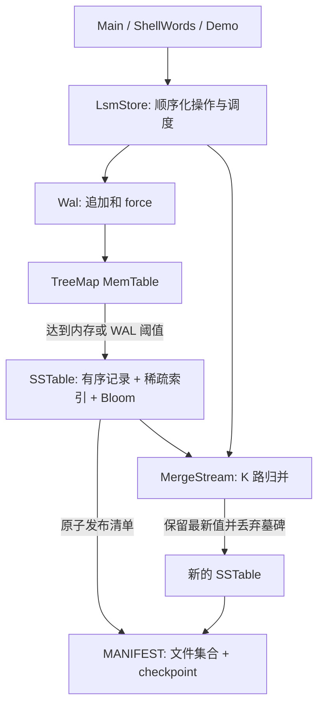

# LSM-Tree 项目设计

## 1. 目标、范围和一致性

实现问题三的全部必选要求，并实现 Bloom Filter。运行依赖仅为 Java 17 标准库，Maven 和 JUnit 5 用于构建、测试。对外提供可嵌入的 `LsmStore` Java API 与 CLI。

- 一个数据库目录只能有一个打开的存储实例，由操作系统文件锁保护；同一实例允许多个线程调用。
- 公开方法使用 `synchronized` 串行化，单条操作具有明确的执行顺序；扫描在锁内完成，返回稳定、不可变结果。
- 每次 `put/delete` 都先追加并 `force(true)` WAL，再更新 MemTable。成功返回的写入在进程异常退出后可恢复。
- 未返回成功的写入可能已经进入 WAL，重启后可能可见；这是常见的“结果不确定”窗口。再次写入同一个 key 或重复删除可获得幂等的最终键值，但会分配新序列号。
- 写入、刷盘或压缩发生 I/O 错误后，当前实例拒绝后续操作，要求关闭并重新打开，以避免使用落后于磁盘提交点的内存状态。

不提供分布式复制、跨 key 事务、MVCC、后台并行压缩、读写多进程共享、RESP 或 HTTP 服务。

## 2. 模块与结构



| 类 | 职责 |
| --- | --- |
| `LsmStore` | API、互斥、序列号、MemTable、刷盘/压缩提交顺序、恢复及清理 |
| `Wal` | 同步追加、记录回放、尾部截断 |
| `Frames` / `RecordCodec` / `Utf8` | 帧校验、记录编解码、UTF-8 严格校验 |
| `SSTable` | 不可变表、持久化稀疏索引、查找/扫描游标、文件完整性检查 |
| `BloomFilter` | 不存在键的快速否定查询 |
| `Manifest` / `DiskIO` | 数据文件集合、checkpoint、原子替换与同步 |
| `EntryStream` / `MergeStream` | 逐条读取及 K 路有序归并 |
| `Main` / `ShellWords` / `Json` | CLI、交互式分词、JSON 输出 |
| `FaultInjector` | 包内测试故障点，不暴露给应用用户 |

## 3. 文件布局与二进制格式

```text
data/my-store/
├── LOCK                             打开的 OS 独占文件锁
├── MANIFEST                         已提交表集合和 checkpoint
├── WAL                              尚未清除的写前日志
├── sst-<UUID>.sst                    已提交或待清理的不可变表
├── sst-<UUID>.sst.tmp                正在生成的表
└── manifest-<UUID>.tmp               正在生成的清单
```

所有整数采用大端序；键和值采用 UTF-8。UUID 文件名避免崩溃后重用文件名覆盖尚未确认的文件。只有 MANIFEST 中列出的 SSTable 才属于数据库；不能依赖目录遍历顺序决定版本。

### 3.1 通用帧

WAL 记录、SSTable 记录、SSTable 元数据、MANIFEST 均使用通用帧：

| 字段 | 字节数 | 说明 |
| --- | --- | --- |
| payloadLength | 4 | 后续 payload 长度 |
| lengthComplement | 4 | `~payloadLength`，检测长度字段损坏 |
| CRC32C | 4 | payload 校验和 |
| payload | N | 具体内容 |

读取时先检查长度和上限，再分配内存。CRC 用于检测意外损坏，不是加密或防篡改机制。

### 3.2 键值记录 payload

| 字段 | 字节数 | 说明 |
| --- | --- | --- |
| sequence | 8 | 大于 0 的单调递增写入序列号 |
| operation | 1 | 1 为 PUT，2 为 DELETE |
| keyLength | 4 | 1–65536 UTF-8 字节 |
| valueLength | 4 | PUT 为 0–4194304，DELETE 为 -1 |
| key | keyLength | UTF-8 键 |
| value | valueLength 或 0 | UTF-8 值；删除没有 value 字节 |

固定 payload 字段为 17 字节，通用帧头为 12 字节。DELETE 在内存中使用 `value == null` 作为 tombstone，空字符串是有效值，二者严格区分。

WAL 是记录帧的连续序列；其格式版本由同目录 MANIFEST 中的版本约束。回放要求 sequence 严格递增。

### 3.3 SSTable

文件依次为 **32 字节固定头 → 按 key 排序的记录帧 → 一个元数据帧**。

| 固定头字段 | 字节数 | 说明 |
| --- | --- | --- |
| magic | 4 | `LSST` (`0x4c535354`) |
| version | 4 | 1 |
| entryCount | 8 | 记录数，含尚未压缩掉的墓碑 |
| indexOffset | 8 | 元数据帧的文件偏移 |
| indexStride | 4 | 该文件自己的索引间隔 |
| headerCRC32C | 4 | 前 28 字节校验和 |

元数据 payload：

1. `indexCount:int`；
2. 重复索引项 `keyLength:int + key:bytes + recordOffset:long`；
3. `bloomHashCount:int`，当前为 7；
4. `bloomByteLength:int + bloomBits:bytes`。

每隔 `indexStride` 条记录索引一次，首条始终有索引。索引按 Java 字符串顺序排列。每个文件存储自己的 stride，因此修改后续启动参数不会破坏旧表索引。

元数据 payload 上限 64 MiB，Bloom 上限 8 MiB。Bloom 采用每个预估键约 10 bit、7 次双重散列；压缩时按所有输入表记录数上界估算，可能分配得比实际存活键需要的空间多。误判为“可能存在”会继续查表，不影响结果。启动校验还会确认实际记录没有被 Bloom 错判为不存在。

为保证机试实现容易审查，打开 SSTable 时会完整扫描记录，检查 CRC、计数、顺序、稀疏索引与 Bloom 的一致性。因此启动时间与数据量相关；不是生产系统的惰性校验模式。

### 3.4 MANIFEST

MANIFEST 是一个通用帧，payload 为：

| 字段 | 类型 | 说明 |
| --- | --- | --- |
| magic | int | `LMAN` (`0x4c4d414e`) |
| version | int | 1 |
| checkpoint | long | 已被提交 SSTable 或压缩结果覆盖的最高写入序列号 |
| tableCount | int | SSTable 数量 |
| tables | repeated | `filenameLength:int + filename:UTF-8`，按最旧到最新排列 |

payload 上限 8 MiB。读取时拒绝重复表名、非法文件名、未知版本和多余字节；文件名只能是引擎生成的 SSTable 名称，避免目录穿越。

checkpoint 即使在所有 key 被删除、压缩后没有任何 SSTable 时也必须保留。否则旧 WAL 可能将已经清除的键重新恢复，或导致序列号重用。

## 4. 写入与刷盘

一次写入在实例互斥锁内完成：

1. 校验键值、UTF-8 编码和大小，分配 `lastSequence + 1`。
2. 编码并追加 WAL，调用 `FileChannel.force(true)`。
3. 将最新记录放入 TreeMap MemTable，扣除被覆盖记录原本占用的编码字节数。
4. 如果 MemTable 字节数达到阈值，或 WAL 总字节数达到阈值，执行同步刷盘。
5. 自动刷盘后，如果 SSTable 数达到 `autoCompactTables`，执行同步全量压缩。

内存阈值使用**记录的编码字节数**，不是 JVM 对象实际堆占用量。WAL 阈值用于防止反复修改一个 hot key 时 MemTable 很小而日志无限增长。触发前仍要容纳当前单条写入，因此最大超出量受单条记录上限约束。

刷盘顺序：

1. 将 MemTable 按 key 顺序写入临时 SSTable，包括 tombstone。
2. 写完整索引、Bloom 和头，`force(true)` 后原子改名为最终 `.sst`。
3. 生成包含原有表和新表的 MANIFEST，checkpoint 设为当前最大序列号。
4. 临时 MANIFEST 写入并 `force(true)`，以 `ATOMIC_MOVE` 原子替换 MANIFEST。**这是刷盘提交点。**
5. 更新内存清单，清空 MemTable。
6. 截断 WAL 到 0，并 `force(true)`。

不能先截断 WAL，也不能仅以“新 SSTable 文件已存在”判断刷盘已提交。不支持原子移动的文件系统会明确抛出错误，不退化为非原子复制。

## 5. 点查询与范围扫描

### 点查询

1. 查 MemTable，命中最新值直接返回，命中墓碑返回不存在。
2. 从最新到最旧检查 SSTable。
3. 对每张表先检查 Bloom；明确不存在时无需打开该表的数据文件。
4. 二分查稀疏索引，定位不大于查询 key 的最大索引 key。
5. 从该偏移顺序读记录，找到 key 即返回，遇到更大 key 或结束即未命中。

表的提交顺序保证后面的表包含更晚的写入；全量压缩后只保留一张最新视图，再将后续新表追加到清单。墓碑一旦命中便停止向旧表搜索。

### 范围扫描

- 区间为 `[fromInclusive, toExclusive)`，null 表示无界。相等边界产生空集，起点大于终点报参数错误。
- 每张表通过稀疏索引定位起点，MemTable 通过 TreeMap 范围视图定位。
- 为每个来源保存一条候选记录，使用最小堆按 key 做 K 路归并。
- 相同 key 选择 sequence 最大的记录，墓碑不放进结果；应用 limit 后尽早结束并关闭所有文件句柄。
- key 排序统一使用 `String.compareTo`，不是 UTF-8 原始字节序或本地化排序。

扫描只缓存来源头部和结果集，不需要一次性载入所有 SSTable 值。返回值占用 O(limit) 结果空间。

## 6. 压缩策略

采用**全量合并**，适合此次简化实现。可手动执行 `compact`；默认每次自动刷盘使表数达到 4 时触发自动压缩。手动 `flush` 只刷盘，不触发自动压缩；可紧接着调用 `compact`。

1. 手动压缩先刷完 MemTable，使 WAL 中的最新写入纳入持久化视图。
2. 对全部 SSTable 做 K 路归并，同 key 只保留最大 sequence。
3. 因为归并覆盖所有旧表，墓碑可以安全丢弃；若只合并部分表，这一步通常是不安全的。
4. 将仍存活的记录写到新表并同步；若全部删除，则不生成空 SSTable。
5. 原子替换 MANIFEST，只引用新表，或引用空表集合；保留原 checkpoint。
6. 提交成功后才删除旧表。删除失败仅导致暂时多占空间，下次启动或压缩重试清理。

默认 K 很小；时间复杂度 O(R log K)，归并工作空间约 O(K) 条记录，另需新表稀疏索引与 Bloom 的空间。压缩为同步操作，会增加触发该次写入的延迟，且暂时需要同时容纳旧表和新表。

## 7. 重启与故障恢复

启动先获取目录独占锁，再读取和校验 MANIFEST、加载所引用的 SSTable，然后回放 WAL。

| 中断位置 | 重启行为 |
| --- | --- |
| WAL 最后一帧写了一部分 | 保留此前完整帧，截断不完整尾部，后续可继续追加 |
| WAL 已同步，MemTable 尚未更新 | 回放 WAL 恢复该写入 |
| 新 SSTable 已同步，MANIFEST 未替换 | 使用旧清单及 WAL；新表视为孤儿，成功恢复后清理 |
| MANIFEST 已提交，WAL 尚未清空 | 加载新表；跳过 `sequence <= checkpoint` 的旧 WAL 记录 |
| WAL 已清空 | 数据已在 MANIFEST 引用的新表中 |
| 压缩输出已完成，MANIFEST 未提交 | 继续使用旧表，清理压缩孤儿输出 |
| 压缩 MANIFEST 已提交，旧表未删除 | 使用新表；清理未被引用的旧表 |

只把物理末尾**不足一帧的字节**视为未完成写入。完整帧 CRC 错误、长度反码错误、非法编码、未知格式版本或非递增 sequence 均明确报错。不会将完整但损坏的记录静默当成“未写入”。CRC 不能修复损坏的数据；恢复算法依赖日志在故障前的完整记录未被外部破坏。

WAL 回放结束后取 `max(checkpoint, 所有已读 WAL sequence)` 为下一次序列号基准。只有大于 checkpoint 的记录进入 MemTable，防止重复回放和删除数据复活。

如果已有 WAL 数据或 SSTable 却缺失 MANIFEST，会拒绝初始化。MANIFEST 引用的 SSTable 缺失也会报错。不会猜测哪个未知文件是最新数据；手工删除数据库组件不属于支持的恢复操作。

成功加载并回放后，清理引擎命名规则内的临时文件和未引用表。不删除 `notes.tmp` 等无关文件。`close()` 仅关闭 WAL 和释放锁，不隐式刷盘；已确认写入已同步在 WAL 中，不依赖正常退出或 shutdown hook。

## 8. 文件系统与持久性边界

文件内容同步使用 JDK [`FileChannel.force`](https://docs.oracle.com/en/java/javase/17/docs/api/java.base/java/nio/channels/FileChannel.html#force(boolean))，提交使用 [`Files.move` 的原子移动选项](https://docs.oracle.com/en/java/javase/17/docs/api/java.base/java/nio/file/Files.html#move(java.nio.file.Path,java.nio.file.Path,java.nio.file.CopyOption...))。

文件内容 `force(true)` 的 I/O 错误会传播，不能当作成功。目录同步通过打开目录并 force 尽力执行，但 Windows 的 Java 文件系统常常不允许打开目录，因此该步骤失败不会阻止操作。这里不将“原子重命名”夸大为所有平台上的“突然断电后目录元数据一定持久化”。

本项目验证了 Windows 上的**进程强制退出恢复**；物理断电、磁盘介质故障、网络文件系统和外部程序修改数据文件不在无损恢复保证范围内。不要直接复制正在写入中的数据库作为备份；应先关闭该数据库实例再复制整个数据目录。

## 9. 验证方案

测试无外部服务依赖，通过 JUnit 临时目录隔离数据：

- `LsmStoreTest`：基础状态、UTF-8/中文路径、空值、阈值刷盘、hot key WAL 控制、稀疏索引、范围边界、快照、压缩回收、并发访问、锁及非法参数。
- 随机模型测试：固定种子执行 400 步 put/delete/flush/compact/reopen，与 TreeMap 参考模型比较。
- `RecoveryTest`：6 个持久化边界的异常注入，以及这 6 个位置的独立 JVM `Runtime.halt(23)`，确保没有执行 close/finally/shutdown hook。
- WAL 尾部测试：对一条记录的每个不完整字节前缀逐一验证截断、既有数据保留和后续追加。
- 损坏测试：完整 WAL CRC、长度字段、UTF-8、sequence、MANIFEST、SSTable 数据和元数据、缺失文件。
- 恢复后的旧 WAL 不得复活已被压缩掉的删除键；失败后锁可释放、实例可重新打开。
- `MainTest`：退出码、JSON 输出、跨命令持久化、Shell 引号/空值/错误恢复。
- `BloomFilterTest`：持久化重建后无假阴性，并检查一组固定不存在键的大部分查询可被过滤。

`scripts/verify.ps1` 额外运行实际 JAR 演示及每条命令使用独立 Java 进程的 CLI 检查。`.github/workflows/ci.yml` 提供 Windows/Linux Java 17 测试矩阵；远端 CI 是否通过应以 GitHub 实际运行状态为准。
